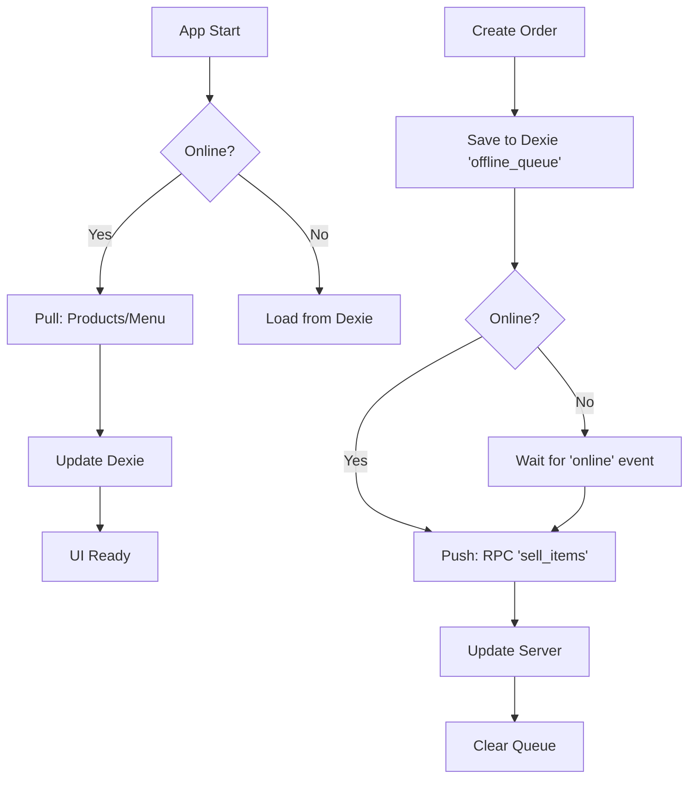

# OpenTill - Technical Architecture & Engineering Guide v2.0

**Status:** Official | **Version:** 2.0 | **Last Updated:** March 2026

---

## 📖 Table of Contents

1.  [**Core Architecture**](#1-core-architecture)
    *   [Frontend Stack](#frontend-stack)
    *   [Backend Services (Supabase/PostgreSQL)](#backend-services-supabasepostgresql)
    *   [Offline-First Strategy (Dexie.js)](#offline-first-strategy-dexiejs)
2.  [**Data Synchronization**](#2-data-synchronization)
    *   [The `syncManager` Service](#the-syncmanager-service)
    *   [Conflict Resolution](#conflict-resolution)
3.  [**Database Schema & Security**](#3-database-schema--security)
    *   [Entity Relationships (ER Diagram)](#entity-relationships-er-diagram)
    *   [Row Level Security (RLS) policies](#row-level-security-rls-policies)
4.  [**Remote Procedure Calls (RPCs)**](#4-remote-procedure-calls-rpcs)
5.  [**Deployment & DevOps**](#5-deployment--devops)

---

## 1. Core Architecture

OpenTill is built as a **Progressive Web App (PWA)** that functions identically on Windows Terminals, iPads, and Android tablets.

### Frontend Stack
*   **Framework**: React 18 + TypeScript (strict mode).
*   **Build Tool**: Vite (for fast HMR and optimized bundling).
*   **State Management**:
    *   **React Context**: For UI state (Modal visibility, current User).
    *   **RxJS**: For complex asynchronous streams (Barcode scanner input).
    *   **SWR**: For data fetching and caching.
*   **Styling**: Tailwind CSS (utility-first).
*   **Local Database**: **Dexie.js** (IndexedDB wrapper) stores the entire product catalog and pending offline orders.

### Backend Services (Supabase/PostgreSQL)
The backend is entirely serverless, leveraging the Supabase platform.
*   **Database**: PostgreSQL 15+.
*   **API Layer**: PostgREST (auto-generated REST API from tables).
*   **Auth**: Supabase Auth (JWT tokens, RLS policies).
*   **Realtime**: Phoenix Channels (WebSocket) for KDS updates.
*   **Edge Functions**: Deno-based serverless functions for third-party integrations (Stripe, UberEats).

### Offline-First Strategy (Dexie.js)
OpenTill treats the local IndexedDB as the "Source of Truth" for the UI during a session.
1.  **Read Path**: App reads products/categories from Dexie.
2.  **Write Path**: App writes orders to Dexie first (`orders` table).
3.  **Sync Path**: A background worker pushes Dexie changes to Supabase when online.

---

## 2. Data Synchronization

### The `syncManager` Service
Located at `src/utils/syncManager.ts`, this singleton class manages the bidirectional data flow.

**Sync Loop Logic:**


### Conflict Resolution
*   **Optimistic UI**: The POS assumes the order succeeds and prints the receipt immediately.
*   **Server Authority**: The Database constraints (e.g., negative stock) are the final arbiter.
*   **Handling Rejections**: If an offline order fails to sync (e.g., card declined), it is flagged in a "Sync Errors" table for manual Manager review.

---

## 3. Database Schema & Security

### Entity Relationships (ER Diagram)
*   **`branches`**: Organizations (Stores).
*   **`users`**: Staff members (linked to `auth.users`).
*   **`products`**: Sellable items (e.g., "Burger").
*   **`variants`**: Specific SKUs (e.g., "Burger - Large").
*   **`ingredients`**: Raw materials (e.g., "Meat Patty").
*   **`product_ingredients`**: Recipe mapping (`variant_id` -> `ingredient_id` + quantity).
*   **`orders`**: Transaction header.
*   **`order_items`**: Line items snapshot (stores name/price at time of sale).
*   **`kitchen_tickets`**: KDS display items.

### Row Level Security (RLS) Policies
Every table has enforced RLS.
*   **`SELECT`**: Allowed if `auth.uid()` belongs to the same `branch_id`.
*   **`INSERT/UPDATE`**: Restricted to specific roles (Manager) or via RPC (Cashier).
*   **`DELETE`**: Only Super Admins.

**Example Policy (Products):**
```sql
CREATE POLICY "View products for branch" ON "public"."products"
FOR SELECT USING (
  branch_id = (SELECT branch_id FROM staff_directory WHERE user_id = auth.uid())
);
```

---

## 4. Remote Procedure Calls (RPCs)

To guarantee ACID compliance, all financial transactions bypass the REST API and use PostgreSQL Functions (PL/pgSQL).

### `sell_items(jsonb)`
**Critical Function**. Handles the entire checkout process in one transaction block.
1.  **Locks** the `gift_cards` row (if used).
2.  **Inserts** `orders` row.
3.  **Iterates** items:
    *   Finds recipe ingredients.
    *   **Updates** `branch_product_stock` (Deduction).
    *   **Inserts** `order_items`.
4.  **Creates** `kitchen_tickets` entry.
5.  **Commits** transaction.

### `increment_gift_card_balance`
Used for topping up cards.
1.  **Verifies** card existence.
2.  **Updates** balance + `last_used` timestamp.
3.  **Logs** audit trail in `gift_card_transactions`.

---

## 5. Deployment & DevOps

### Environment Variables
*   `VITE_SUPABASE_URL`: API Endpoint.
*   `VITE_SUPABASE_ANON_KEY`: Public client key.
*   `SUPABASE_SERVICE_ROLE_KEY`: (Backend Only) Admin key.

### CI/CD Pipeline
1.  **GitHub Actions**: Runs on push to `main`.
2.  **Test**: Runs `vitest` unit tests.
3.  **Lint**: Runs `eslint`.
4.  **Build**: Runs `tsc` and `vite build`.
5.  **Deploy**: Pushes to Vercel (Frontend) and Supabase (Edge Functions).

### Monitoring
*   **Sentry**: Frontend error tracking.
*   **Supabase Dashboard**: Database performance and API logs.
